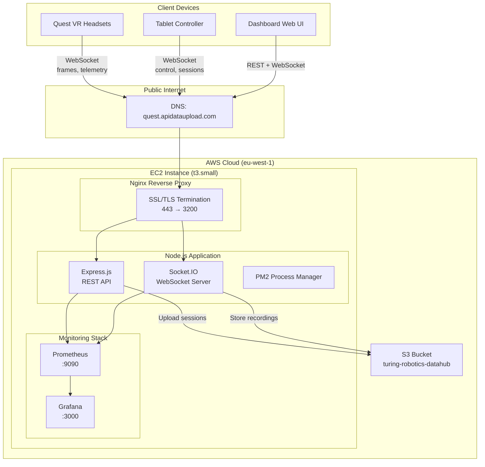
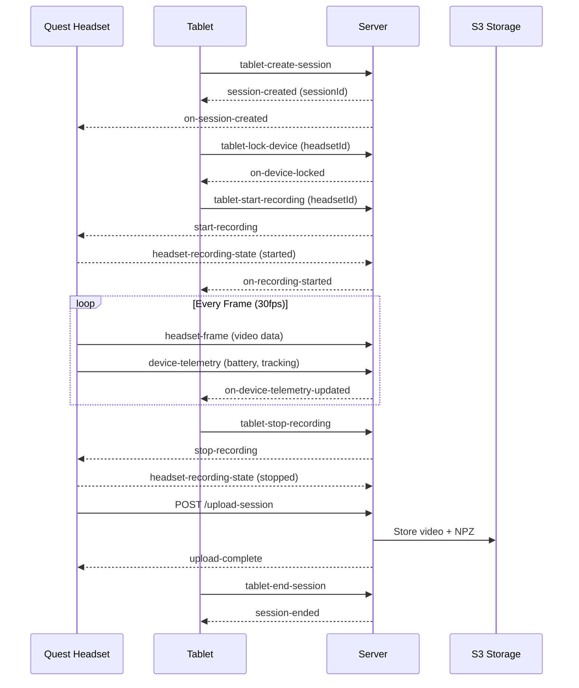
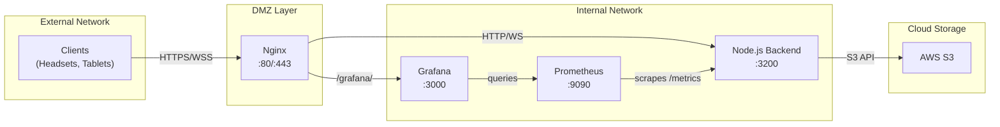

# Capture Backend Server

Real-time data capture and fleet management system for Quest VR headsets. Handles multi-device coordination, video streaming, file uploads, and monitoring.

---

## System Architecture



---

## Data Flow



---

## Network Architecture



---

## Tech Stack

| Component | Technology |
|-----------|------------|
| Runtime | Node.js v20 LTS |
| Framework | Express.js + Socket.IO |
| Language | TypeScript |
| Process Manager | PM2 |
| Reverse Proxy | Nginx |
| Storage | AWS S3 |
| Monitoring | Prometheus + Grafana |
| Logging | Pino (JSON) |

---

## Features

- **Multi-device control** - Tablet locks and controls headsets exclusively
- **Real-time streaming** - 30fps video frames via WebSocket
- **Chunked uploads** - Files up to 20GB with resume support
- **Fleet monitoring** - Battery, storage, tracking status for all devices
- **Session management** - Create, start, pause, end recording sessions
- **Metrics** - 40+ Prometheus metrics for observability

---

## Quick Start

```bash
# Clone
git clone https://github.com/Turing-Robotics/capture-backend.git
cd capture-backend

# Install
npm install

# Configure
# Create .env file with required environment variables (see below)

# Build
npm run build

# Run
npm start
```

---

## Environment Variables

| Variable | Required | Description |
|----------|----------|-------------|
| `AWS_ACCESS_KEY_ID` | Yes | AWS access key |
| `AWS_SECRET_ACCESS_KEY` | Yes | AWS secret key |
| `AWS_REGION` | Yes | AWS region (eu-west-1) |
| `S3_BUCKET_NAME` | Yes | S3 bucket name |
| `JWT_SECRET` | Yes | Secret for JWT tokens |
| `ADMIN_API_KEY` | Yes | API key for admin endpoints |
| `NODE_ENV` | No | production or development |
| `PORT` | No | Server port (default: 3200) |

Generate secure secrets:
```bash
# JWT Secret
openssl rand -base64 48

# Admin API Key
openssl rand -base64 32
```

---

## API Endpoints

### REST

| Method | Endpoint | Description |
|--------|----------|-------------|
| GET | `/test` | Health check |
| GET | `/metrics` | Prometheus metrics |
| POST | `/upload-session` | Upload video + data |
| POST | `/chunked-upload/start` | Start multipart upload |
| POST | `/chunked-upload/complete` | Complete upload |
| GET | `/api/devices` | List all devices |
| GET | `/api/fleet/summary` | Fleet statistics |
| GET | `/api/sessions` | List sessions |

### WebSocket Events

**From Headset:**
- `headset-identify` - Register device
- `headset-frame` - Video frame data
- `device-telemetry` - Device status

**From Tablet:**
- `tablet-lock-device` / `tablet-unlock-device`
- `tablet-start-recording` / `tablet-stop-recording`
- `tablet-create-session` / `tablet-end-session`

**Broadcasts:**
- `on-headsets-updated` - Device list changed
- `on-device-telemetry-updated` - New telemetry
- `on-session-created` / `on-session-ended`

See [docs/API.md](docs/API.md) for complete API documentation.

---

## Project Structure

```
capture-backend/
├── src/
│   ├── app.ts              # Main server (Express + Socket.IO)
│   ├── auth.ts             # JWT authentication
│   ├── metrics.ts          # Prometheus metrics
│   ├── rateLimiter.ts      # Rate limiting
│   ├── validation.ts       # Input validation (Zod)
│   ├── logger.ts           # Pino logging
│   ├── qa-metrics.ts       # QA metrics API
│   └── s3-stats.ts         # S3 statistics API
├── grafana/
│   └── dashboards/         # Grafana dashboard JSON
├── prometheus/
│   └── prometheus.yml      # Prometheus config
├── scripts/
│   └── parse_npz.py        # NPZ parsing utility
├── docs/
│   ├── API.md              # API documentation
│   ├── SETUP.md            # Setup guide
│   └── SCHEMA.md           # Data schemas
├── package.json
└── tsconfig.json
```

---

## Production Deployment

### Server Requirements

- Ubuntu 22.04+ LTS
- Node.js v20 LTS
- 2GB RAM minimum
- PM2 process manager

### Deploy Steps

```bash
# 1. Install Node.js
curl -fsSL https://deb.nodesource.com/setup_20.x | sudo -E bash -
sudo apt-get install -y nodejs

# 2. Install PM2
sudo npm install -g pm2

# 3. Clone and setup
git clone https://github.com/Turing-Robotics/capture-backend.git
cd capture-backend
npm install
npm run build

# 4. Configure environment
nano .env
# Add required environment variables

# 5. Start with PM2
pm2 start app.js --name capture-backend
pm2 save
pm2 startup
```

### Nginx Setup

```bash
# Install nginx
sudo apt install nginx

# Configure reverse proxy to port 3200
# Add server block with proxy_pass to localhost:3200

# Get SSL certificate
sudo apt install certbot python3-certbot-nginx
sudo certbot --nginx -d your-domain.com

# Reload
sudo nginx -t && sudo systemctl reload nginx
```

See [docs/SETUP.md](docs/SETUP.md) for detailed deployment instructions.

---

## Monitoring

### Grafana Dashboards

Three pre-built dashboards in `grafana/dashboards/`:

1. **System Overview** - Device connections, session activity, system health
2. **S3 Analytics** - Storage usage, upload stats, cost tracking
3. **QA Monitoring** - Capture quality metrics, validation results

### Prometheus Metrics

Server exposes metrics at `/metrics`:

```
turing_connected_devices_total
turing_recording_devices_total
turing_sessions_active_total
turing_uploads_in_progress
turing_http_request_duration_seconds
```

---

## S3 Data Structure

```
s3://turing-robotics-datahub/
├── sessions/
│   ├── 20260206_143052/
│   │   ├── recording.mp4       # H.264 video
│   │   └── session_data.npz    # NumPy tracking data
│   └── 20260206_151230/
│       ├── recording.mp4
│       └── session_data.npz
└── client_output/
    └── processed_files.zip
```

---

## Development

```bash
# Install dependencies
npm install

# Build TypeScript
npm run build

# Run in development
npm run dev

# Run tests
npm test
```

---

## Documentation

- [Setup Guide](docs/SETUP.md) - Installation and deployment
- [API Reference](docs/API.md) - Endpoints and events
- [Data Schemas](docs/SCHEMA.md) - Data structures

---

## License

Proprietary - Turing Robotics
